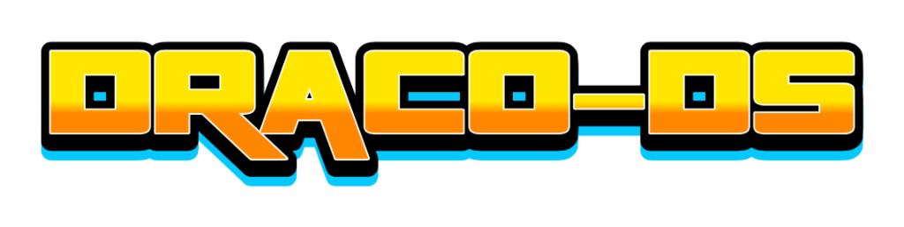
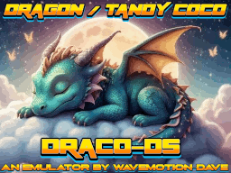
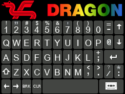
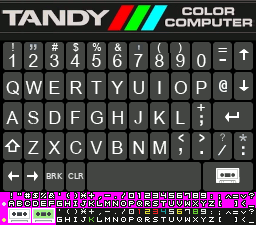
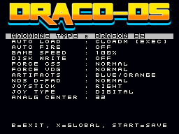
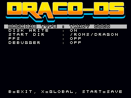
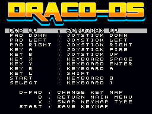

# DracoDS
DracoDS is a Tandy Color Computer (CoCo 2) and Dragon 32/64 emulator for your DS/DSi/XL/LL handheld.

The Dragon and Tandy machines were quite similar - both using the same Motorola reference design and, when you 
really look under the hood, it's pretty clear that the Dragon reverse-engineered some of the Tandy
hardware such that it was virtually identical in some spots (e.g. Cartridge pinouts). There are some
differences - mainly in the keyboard matrix handling and in some of the disk controller handling. 

To that end, this emulator is primarily a Tandy CoCo 2 emulator with 32K standard and 64K expanded
support but it also works for the Dragon 32/64 and can be configured as such.



Features :
-----------------------
* Tandy CoCo 2 support with 32K and 64K of RAM. Running at 60Hz NTSC.
* Dragon 32/64 support with 32K and 64K of RAM. Running at the 50Hz PAL speed.
* Cassette (.cas) support for both the Dragon and Tandy emulated machines.
* Cartridge (.ccc or .rom) support for the Tandy emulated machine.
* Disk (.dsk) support for the Tandy emulated machine. Standard single-sided 160K (35 track) or 180K (40 track) disks only.
* Save/Load Game State (one slot).
* Artifacting support to 4-color high-rez mode (and the ability to swap BLUE/ORANGE on a per-game basis).
* LCD Screen Swap (press and hold L+R+X during gameplay).
* LCD Screen snapshot - (press and hold L+R+Y during gameplay and the .png file will be written to the SD card).
* Virtual keyboard stylized to the machine you've picked (there is a default global machine and you can override on a per-game basis)
* Full speed, full sound and full frame-rate even on older hardware.




Copyright :  
-----------------------
DracoDS is Copyright (c) 2025 Dave Bernazzani (wavemotion-dave)

This is a derivitive work of Dragon 32 Emu Copyright (c) 2018 Eyal Abraham (eyalabraham)
which can be found on github:

https://github.com/eyalabraham/dragon32-emu

The dragon32-emu graciously allows modification and use via the lenient MIT Licence.

As far as I'm concerned: as long as there is no commercial use (i.e. no profit is made),
copying and distribution of this emulator, it's source code and associated readme files,
with or without modification, are permitted in any medium without royalty provided this 
copyright notice is used and wavemotion-dave and eyalabraham are thanked profusely.

Royalty Free Music for the opening jingle provided by Anvish Parker

lzav compression (for save states) is Copyright (c) 2023-2025 Aleksey 
Vaneev and used by permission of the generous MIT license.

The DracoDS emulator is offered as-is, without any warranty.

Credits :
-----------------------
Thanks to eyalabraham who provided the baseline code - without that work, this derivation doesn't happen.

Thanks to Darryl Hirschler for source keyboard graphics (modified for Dragon/Tandy use).


BIOS/BASIC Files Needed :
-----------------------
```
* e3879310 dragon32.rom - Dragon BASIC 16K
* 54368805 bas12.rom - Tandy CoCo BASIC 8K
* a82a6254 extbas11.rom - Tando CoCo Extended BASIC 8K
* 0b9c5415 disk11.rom - Tandy CoCo Disk Extended BASIC 8K
```

The disk ROM is optional - but if you don't have it, then .dsk files will be hidden from the loader menu.

Place the BIOS/BASIC files in /roms/bios or else in the same directory as the emulator itself.

Loading Games :
-----------------------
There are three kinds of files supported: Cartridges, Cassettes and Disks.

Cartridges are the easiest... simply pick the .ccc (or .rom) filename from the Load Game menu and as soon as you start the emulation, the cartridge should auto-boot.

Cassettes work differently... you must load them up from the BASIC intepreter. So picking a .cas filename from the Load Game menu and starting the emulation
running should place you into the BASIC of your choice (Tandy CoCo BASIC or Dragon BASIC). From there, you type one of the following pairs of commands depending
on whether you are loading a Machine Code game (95% of the time this is true) or a BASIC game:
```
CLOADM
EXEC

CLOAD
RUN
```

You can press the START button to automatically issue the 'CLOADM' command. Note that you must wait for the Cassette to load after the CLOAD/CLOADM commands - the tape icon 
should go from green (reading) to white and the OK prompt should appear on BASIC again before you type the EXEC/RUN command.

Disks are the most complicated.  After loading you should do a DIR to see the contents of the disk. Then you issue a pair of commands as follows:

```
LOADM "FILENAME"
EXEC

LOAD "FILENAME"
RUN
```

Where FILENAME is the desired file as shown in the DIR command. You can press the START button right after starting the game to automatically list the contents of the disk via DIR.

Dragon vs Tandy Mode :
-----------------------
The default mode is Tandy CoCo. You can change the default in Global Settings. You can also override on a per-game basis. Be sure to run games intended for the Dragon in Dragon mode (you should see the Dragon logo on the keyboard) and be sure to run Tandy CoCo games in Tandy mode (the Tandy Color Computer logo should be shown on the main keyboard graphic).

Blue or Orange Screen? :
-----------------------
Because the artifacting on an NTSC CoCo was a bit hit-or miss (that is, from one setup to another it might reverse the Orange/Blue colors), some games took to 
putting up an artifacting wall of color on the opening screen to allow the user to press RESET so that the color might change... if you see this in any 
game, just press ENTER (some games might use SPACE) to bypass it.  DracoDS should present the standard artifacting color set by default but you can swap it 
on a per-game basis in the Game Settings.

Disk Support :
-----------------------
For the Tandy CoCo emulation, .dsk files are supported in the popular 160K 35-track and 180K 40-track varieties. The disks are auto-written back to the
SD card if the contents change. To that end, this is hobby-software and the FAT implementation in libnds is not bullet-proof... so there is always a non-zero chance
that the .dsk file could be corrupted. This is highly unlikely but if you're concerned, keep a backup and you can also turn off disk writes in the per-game or 
global configuration (it will still 'write' the disk into memory but will not try to write it back and persist it on the SD card).

Configuration Options :
-----------------------
DracoDS includes global options (applied to the emulator as a whole and all games) and game-specific options (applied to just the one game file that was loaded).




Key Mapping Options :
-----------------------
Each game can individually configure any of the 12 DS buttons (D-PAD, ABXY, L/R, START/SELECT) to a single CoCo/Dragon joystick or keyboard button. The default is for the D-PAD 
and Button A to replicate the joystick but you can configure as you like. Pressing the X button on this screen will toggle between some preset defaults for common joystick 
maps - such as using the D-PAD as the keyboard cursor keys (up, down, left, right arrows).



Joystick Options :
-----------------------
The Tandy CoCo and Dragon machines used an analog joystick that is difficult to emulate properly on the DS/DSi. To that end, the default 'Joystick' is digital - that 
is, pressing the D-Pad will emualte extreme analog positions of a real joystick. This works fine for many games... but some games really did take advantage of the
multi-position of a real analog stick. So you can change the default 'DIGITAL' controller to 3 speeds of Analog - both self-centering and none. Games like POLARIS, for
example, play fine with the 'SLOW ANALOG' setting.  Experiment and figure out what works best for any given game. Your joystick settings are saved on a per-game basis.

Here is a short breakdown of the various joystick handling modes:

* DIGITAL - Pressing any direction instantly brings the analog axis value to the min/max. Releasing keys brings it back to the center position (32,32).
* ANALOG SLOW - Pressing any direction moves the analog values towards either min or max (depending on direction pressed) and does not auto-center.
* ANALOG MEDIUM - Pressing any direction moves the analog values towards either min or max (depending on direction pressed) and does not auto-center.
* ANALOG FAST - Pressing any direction moves the analog values towards either min or max (depending on direction pressed) and does not auto-center.
* SLOW CENTER - Pressing any direction moves the analog values towards either min or max (depending on direction pressed) and when released, brings it back to center.
* MEDIUM CENTER - Pressing any direction moves the analog values towards either min or max (depending on direction pressed) and when released, brings it back to center.
* FAST CENTER - Pressing any direction moves the analog values towards either min or max (depending on direction pressed) and when released, brings it back to center.
* DIGITAL OFFSET - Pressing any direction moves the analog values towards either min or max (depending on direction pressed) and when released, brings it _almost_ to center but leaves it slightly towards the last value pressed. Useful for some maze games.

The default joystick is the RIGHT port joystick but every game seems to be different... if the game isn't responding to the RIGHT joystick port, switch it in the 
game options to the LEFT port (you don't have to exit the game to make this change - the DS MINI menu has the Game Options available from the little Cassette Icon)

There is also a very useful mode of the d-pad called "SLIDE-N-GLIDE" which was originally designed by me to play and enjoy Chuckie Egg on my ZX Spectrum Emulator. 
If you've ever played a ladder climbing game or maze game where getting on/off the ladder or turning a corner was difficult, then SLIDE-N-GLIDE might be just the
ticket. It causes the movement of the player to continue to move in the horizontal or vertical direction while you change direction on the d-pad. This makes for 
much smoother transitions onto/off laders and makes for very easy cornering in maze games. Turn this on in configuration - you may just find it the most enjoyable 
option in the emulator!

Keyboards :
-----------------------
Both the Tandy and Dragon keyboards behave the same - there is only the cosmetic difference of the company banner/logo at the top.  Note that due to the limitations
of the DS touch-screen where only one key can be pressed at a time, the SHIFT key works like a temporary toggle. Press it and then the next key you press will be SHIFT-ed.

Dungeons of Daggorath :
-----------------------
My favorite CoCo game! To that end, I've added 8 special 'MACRO' keys to the possible keyboard map to allow you to map a key to "ATTACK LEFT", "ATTACK RIGHT", "MOVE", "MOVE BACK", 
"TURN LEFT", "TURN RIGHT", "PULL LEFT" and "PULL RIGHT". If you're using one of the standard cart ROMs, these should map in automatigally but you can map these to the d-pad or any
buttons you wish and playing DoD will be a joy.

The Colors Aren't What I Remember :
-----------------------
Probably true. First of all, the colors are an approximation with emulation but the bigger issue is that this emulator (in order to gain the emulation speed needed) has scanline granularity. 
Some games will change the color set as the beam races down the screen... and that's super cool! It's also not something that DracoDS supports (at least not yet). So yeah... it's possible
your light red fire will render as a light blue flame - but it's a small price to pay to get all this stuff playable no the tiny DS handheld.

Artifact Colors
-----------------------
One of the hallmarks of NTSC high-resolution on the CoCo is the artifact colors which turn white-black-white pixels into a light blue and orange (often referred to as 'red') colors depending
on the position of the bright and dark pixels. This emulator will do a "poor-man-artifacting"... it's not perfect and there will be some areas that are a bit more jagged than a real system
but it's blazing fast and runs well on the DS and looks good enough for playing most things.

Screenshot and Screen Swap:
-----------------------
Pressing and holding the L/R shoulder buttons plus X will exchange the top and bottom screens. However, only the bottom screen is touch-sensitive so you would still need to press on the bottom screen to make the touch screen work.

Pressing and holding the L/R shoulder buttons plus Y will create a screen snapshot of the game screen. It will be time/date stamped and written to the SD card in the same directory as the game file.

Known Issues:
-----------------------
* Manic Miner (both Dragon and the CoCo port) will load but Willy just jumps constantly. Cause unknown.
* OS-9 disks will not run correctly. Likely cause is the disk controller (FDC) handling as the Read Sector in OS-9 differs from the RSDOS handling.

Compile Instructions :
-----------------------
gcc (Ubuntu 11.3.0-1ubuntu1~22.04) 11.3.0
libnds 1.8.2-1
I use Ubuntu and the Pacman repositories (devkitpro-pacman version 6.0.1-7).  I'm told it should also build under 
Windows but I've never done it and don't know how.

If you've got the nds libraries above setup correctly it should be a matter of typing:
* _make clean_
* _make_

To build the emulator. The output of this is ColecoDS.nds with a version as set in the MAKEFILE.
I use the following standard environment variables that are SET on Ubuntu:
* DEVKITARM=/opt/devkitpro/devkitARM
* DEVKITPPC=/opt/devkitpro/devkitPPC
* DEVKITPRO=/opt/devkitpro

To create the soundbank.bin and soundbank.h (sound effects) file in the data directory:

mmutil -osoundbank.bin -hsoundbank.h -d *.wav

And then move the soundbank.h file to the arm9/sources directory

Versions :
-----------------------
V1.1: 18-July-2025 by wavemotion-dave
* Fixed DAA instruction - BCD math now correct. Fixes Trapfall, Atom and more.
* Improved Semi-Graphics handling so occasional tops of fonts are not cut-off.
* Improved joypad 'Center+Offset' handling.
* Other minor cleanups as time permitted.

V1.0: 14-July-2025 by wavemotion-dave
* Fixed keyboard graphic (glitch on key 8 and 9)
* Fixed Semi Graphic 24 mode (fixes Protector, etc)
* Fixed button issues on Buzzard Bait
* Improved handling of Digital Offset (El Bandito)
* Improved Dungeons of Daggorath macros
* Allow .ROM files to be loaded (same as .CCC files)
* More cleanups and a bit of polish for the first big release.

V0.9: 11-July-2025 by wavemotion-dave
* Full 64K support working - Sailor Man plays!
* Ability to swap a disk in the mini-menu.
* Improved joystick handling options.
* Improved artifact handling - new options to swap the Blue/Orange artifacts or turn them off.
* Other minor improvements as time permitted.

V0.8: 09-July-2025 by wavemotion-dave
* Added disk write-back to SD support. 
* Improved artifact color handling.
* Better 'Auto-Center' of analog joysticks.
* Other minor improvements as time permitted.

V0.7: 07-July-2025 by wavemotion-dave
* Numerous small fixes for joystick/keyboard handling.
* Fix for the SemiGraphics Modes not showing anything (blank screen).
* Improved Disk Icon.
* Improved 64K memory handling - we now pass the known 64K mem tests (still... Sailor Man won't run).
* Pressing START will now Load and Run cassette based games.
* Other small tweaks and improvements across the board.

V0.6: 06-July-2025 by wavemotion-dave
* Disk sizes supported now includes 160K (35 track) and 180K (40 track).
* Improved disk read/write handling (still not backed to SD)
* Proper disk icon when a .dsk is loaded and floppy loading sounds added.
* Improved PIA handling to eliminate small sound glitches on some games.
* Mirrors for PIA now handled.
* Macros for Dungeons of Daggorath added!
* Added first pass at Save/Load State

V0.5: 05-July-2025 by wavemotion-dave
* First public beta!
